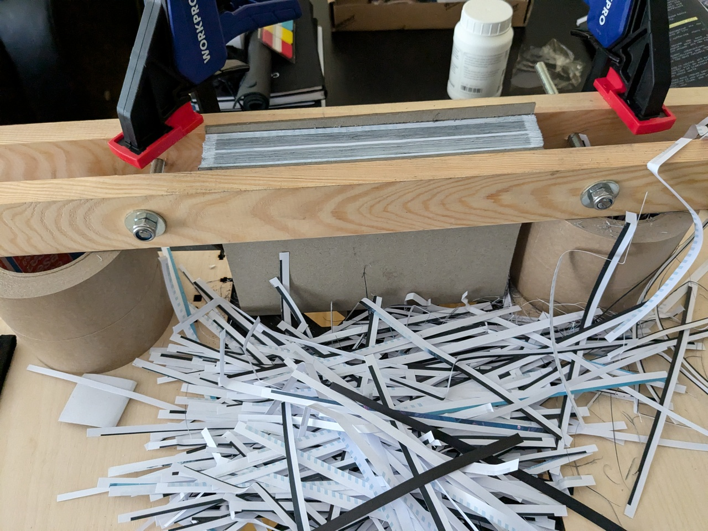

<!-- .element: class="layout-center" -->

# Let's bind a book!

Gina Häußge // <a href="https://foosel.net">foosel.net</a>

---

<!-- .element: class="layout-center" -->

Do you have a PDF that you'd love to turn into a book?

Why not bind it yourself?<!-- .element: class="fragment" -->

It's fun, trust me! I'll show you!<!-- .element: class="fragment" -->

--- 

<!-- .element: class="layout-center" -->

[momijizukamori.github.io/bookbinder-js](https://momijizukamori.github.io/bookbinder-js/)

Notes:

- First use Bookbinder JS to convert your PDF into signatures
- Signatures = 4 sheets of paper folded together
- several signatures together make up the whole book 

---

<!-- .element: class="layout-center" -->

Notes:

- print your signatures and fold each of them
- use awl & template to put regular hole pattern on the spines
- also add a flysheet from folded colored paper to the front and the back

---

<!-- .element: class="layout-center" -->

Notes:

- Then the sewing begins!
- grab some waxed thread and needle and sew all of those signatures together
- sew in some fabric bands, those will be used to connect the text block you are creating to the covers
- be sure to keep them in the right order!

---

<!-- .element: class="layout-center" -->

Notes:

- you still need to cut the text block on three sides so its straight and feels good to leaf through
- clamp it down with a straight edge at the level you need to cut it 
- go to town with a sharp chisel, slice by slice
- this takes a while, listen to some podcast maybe?

---

<!-- .element: class="layout-center" -->

Notes:

- next we glue up the spine!
- add some bookbinder's glue or if it comes to shove PVA to the spine
- add a piece of thin fabric or cardstock to make things more stable
- now is also the time where you add book bands or other fun stuff

---

<!-- .element: class="layout-center" -->

Notes:

- create a three part cover from greyboard (heavy cardboard) and some book cloth (fabric backed with paper)
- glue the strips you sewed to the spine to the inside of the covers, hanging the book in there
- cover the strips with one half of the folded flyleafs
- put everything into a press - even an improvised one works

---

<!-- .element: class="layout-center" -->

Notes:

- Congratulations, you have a book!
- It's amazing being able to leaf through a book you bound yourself!

---

<!-- .element: class="layout-center" -->

And next time:

How to make softcover paperbacks!

Notes:

- And next time, we'll do softcover paperbacks!

